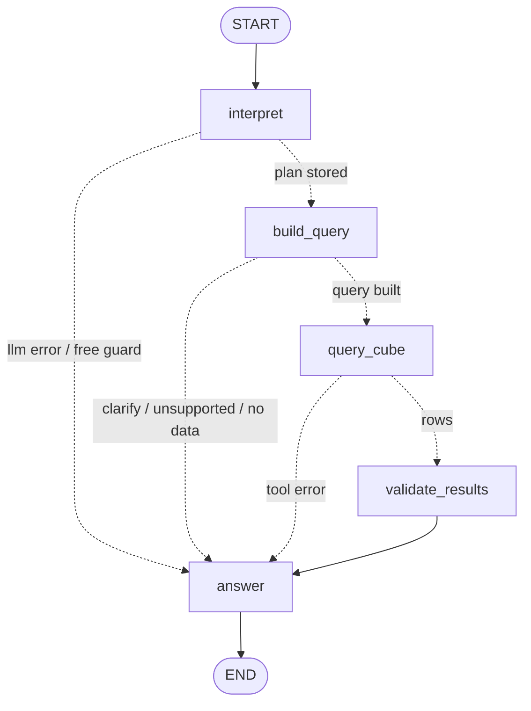

# ff-analytics-agent

A small marketing-analytics agent: you ask a question in plain English, it answers from a mock warehouse — **grounded in a Cube semantic layer, never in raw tables**.

> **Video walkthrough:** _link goes here_

```
Browser (static HTML)  →  FastAPI  →  LangGraph (5 nodes)  →  Cube Cloud (REST)  →  ClickHouse Cloud
                                          │
                                          ├─ OpenRouter free router (one planning call per question)
                                          └─ Langfuse Cloud (one trace per question)
```

The language model's only job is to fill in a small JSON form (**which metrics, which dimension, which period, which filters**). Everything else is deterministic code: validating every name against Cube's `/meta`, resolving dates, building the Cube query, checking the rows, and rendering the answer from a template. The model never sees SQL, never sees the Cube query, and never writes a number.

---

## Quick start

Prerequisites: Python 3.12, [`uv`](https://docs.astral.sh/uv/), and four accounts — three free tiers (Cube Cloud, OpenRouter, Langfuse Cloud) plus a ClickHouse Cloud 30-day trial (see [Reproducing this as a reviewer](#reproducing-this-as-a-reviewer)).

```bash
uv sync --extra seed          # installs the app (and clickhouse-connect for the seed script)
cp .env.example .env          # fill in the values described in .env.example
make seed                     # creates the 3 tables in ClickHouse Cloud and loads the generated data
# deploy cube/ to a Cube Cloud deployment (GitHub import, project directory = cube), set CUBEJS_API_SECRET there
make cube-check               # readyz + signed /meta: the view must be listed
make serve                    # http://127.0.0.1:8000
make examples                 # the 9 repeatable questions, printed with outcomes and trace ids
make eval                     # plan accuracy of the real model on 15 golden questions (no Cube queries)
make test                     # 188 offline tests (+3 opt-in live), zero network
```

`.env.example` documents every variable. Nothing in the repo contains a secret (`make check-secrets`).

---

## Supported questions

| Kind | Example | What happens |
|---|---|---|
| Breakdown | *How much did we spend by channel in August 2026?* | one Cube query, a table with a total row |
| Ranking | *Which campaign had the strongest result relative to spend last month?* | ranked by ROAS; rows whose ROAS is undefined (spend $0) are excluded **and named** |
| Filtered ranking | *Which device had the better ROAS in Germany over the last 3 months?* | filter `country = DE`, grouped by device ("Germany" → `DE` via a small alias table) |
| Ratio by dimension | *What was the average order value by objective in Q2 2026?* | quarter token, AOV from the semantic layer |
| Period comparison | *What changed between July and August by channel?* | **one** Cube `compareDateRange` query; deltas and % computed in code, "n/a (from 0)" on a zero base |
| Unsupported metric | *Which campaign had the best profit margin?* | "Unknown metric 'profit_margin'" + the available vocabulary — **0 Cube calls** (if other, known metrics were also asked for, they are answered and the unknown one is named in a caveat) |
| Ambiguous | *How did we do recently?* | asks which period and which metric — 0 Cube calls; replying in the chat ("July, all metrics") answers the original question |
| Genuinely empty | *How many purchases did Summer Sale get in August 2026?* | Cube returns no rows (the campaign ran only in July) → "No rows … the warehouse covers 2026-03-01 to 2026-08-31" |
| Outside the data | *Spend by channel in 2024* | refused before any query: "Data covers …; there is nothing for 2024-01-01 to 2024-12-31" (a bare year is not in the period grammar, so the model expresses it as an explicit range; if it cannot, the agent asks for clarification) |
| Tool error | Cube unreachable / wrong secret | "The semantic layer returned an error (403: Invalid token). No answer was produced." — the tool span is marked ERROR in the trace |

Every reply ends with a footer: the filters, the routed model with its cost ($0) and the Cube-call count always; the **period (UTC, inclusive)** once one was resolved; the **metric definitions (Cube's own `description` strings)** on data answers and no-data replies.

Period grammar the model may use: `last_month`, `last_N_months`, `all_time`, `YYYY-MM`, `YYYY-QN`, `YYYY-MM-DD..YYYY-MM-DD`, and `previous_period` for comparisons. Dates are resolved by code against a pinned "today" (`AGENT_AS_OF_DATE=2026-09-14`) so the demo is reproducible; Cube's relative date strings are deliberately not used because they follow the real clock.

---

## The decisions the brief left open

### D1 — Warehouse schema and fake data

Three tables in ClickHouse Cloud (`warehouse/schema.sql`), at realistic grains:

| table | grain | rows |
|---|---|---|
| `campaigns` | one row per campaign: name, channel, country, objective, active window | 12 |
| `ad_spend` | one row per campaign × day × device: spend, impressions, clicks | 2,956 |
| `purchases` | one row per purchase event: timestamp (UTC), campaign, device, revenue | 8,672 |

`warehouse/generate_data.py` builds the rows deterministically (`random.Random(42)`) from a small table of campaign constants over March–August 2026: five channels (google, meta, tiktok, linkedin, email), three countries (US, UK, DE), three objectives, two devices, and a summer seasonality curve. `warehouse/seed.py` loads them with ClickHouse's official Python client (`clickhouse-connect`); it drops and recreates the tables, so it is safe to re-run.

The constants are chosen so that questions have **checkable, non-trivial answers** — not so that answers are hardcoded anywhere (the agent computes everything through Cube):

| campaign | the story |
|---|---|
| Brand Search US | most purchases overall |
| Generic Search US | spend steps up 40% in July, purchases stay flat → cost per purchase worsens |
| Shopping DE | desktop converts ~2× better than mobile |
| Prospecting Video | highest spend, worst cost per purchase, ROAS < 1 — "biggest ≠ best" |
| Retargeting Carousel | best ROAS and CPA, paused on 15 August |
| Summer Sale | ran only 10–31 July → any August question is genuinely empty |
| TikTok Spark UK | ROAS collapses in August (purchases drop ~85%) |
| TikTok Creator DE | launched 1 June → absent before then, so it shows as `[new]` in a May-vs-June comparison |
| LinkedIn Leads UK | expensive clicks, low volume, high order value |
| LinkedIn Thought Leadership | ended in May |
| Winback Series, Newsletter Promo | email: **no spend rows at all** → every cost ratio is NULL and must be handled, not divided by zero |

### D2 — Measures and dimensions exposed through Cube

`cube/model/` defines one wide daily cube, `campaign_daily` (a plain `UNION ALL` of spend rows and purchase events), joined to `campaigns`, and exposes a single view **`marketing_performance`** — the only thing the agent queries.

| measure | definition (paraphrased here; the exact `description` strings in `cube/model/cubes/campaign_daily.yml` are what the prompt and the footer quote) | format |
|---|---|---|
| `spend`, `revenue` | sums in USD | `currency_2` |
| `impressions`, `clicks`, `purchases` | sums | `number_0` |
| `cost_per_purchase` | spend / purchases; null when spend = 0 or purchases = 0 | `currency_2` |
| `roas` | revenue / spend; null when spend = 0 | `number_2` |
| `cpc` | spend / clicks; null when clicks = 0 | `currency_2` |
| `cpm` | spend per 1,000 impressions; null when impressions = 0 | `currency_2` |
| `ctr` | clicks / impressions; null when impressions = 0 | `percent_2` |
| `conversion_rate` | purchases / clicks; null when clicks = 0 | `percent_1` |
| `aov` | revenue / purchases; null when purchases = 0 | `currency_2` |

Dimensions: `channel`, `campaign_name`, `country`, `objective`, `device`; time dimension `date` (UTC). Two internal measures, `first_date` / `last_date`, give the app the data coverage window and are hidden from the model.

Why this shape: **ratios must be ratios of sums for whatever period and grouping the user asked for**, which is exactly what a semantic layer is for — so every ratio is a Cube measure defined once, with `NULLIF` instead of division errors and `toFloat64` to avoid Decimal truncation. Rankings, totals, ties and period deltas are operations over *one result set* and live in Python, where they are unit-tested with fixed rows. Cube's `format`/`currency`/`shortTitle`/`description` metadata (returned in every `/load` annotation) drives all number formatting and column headers, so the semantic layer is the single source of truth for what a metric looks like too.

### D3 — LangGraph state and node design

Five nodes with one responsibility each (`app/agent/`), routed by pure functions on `state.outcome`; every early exit still goes through `answer` so the user always gets an honest, rendered reply.



| node | kind | responsibility |
|---|---|---|
| `interpret` | **LLM** (the only model call) | question → `Plan` JSON; one repair turn for malformed JSON, a fresh re-roll for empty/off-task replies, at most 3 planning attempts |
| `build_query` | deterministic | owns every plan-level decision: validates each name against the catalog, resolves the period, checks coverage, adds ratio numerators/denominators, builds the Cube query |
| `query_cube` | **tool** | `cube_dry_run` then `cube_load` (LangChain `StructuredTool`s, so they are tool spans in the trace); the only I/O |
| `validate_results` | deterministic | shape checks, `Decimal` parsing with NULLs preserved, ratio recomputation, rankings with NULL exclusion and ties, period deltas |
| `answer` | deterministic | templates + footer; never computes, never prints the model's free text |

State is a `TypedDict` (`app/models/state.py`); dependencies (LLM, Cube tools, catalog, as-of date) are injected through LangGraph's `context_schema`, which is what makes the whole graph testable offline with a fake LLM and a stub Cube. `docs/graph.md` is generated from the compiled graph by `make graph`, so the diagram cannot drift from the code.

### D4 — The boundary between the model, the tools and deterministic code

| decision | owner | what makes it safe |
|---|---|---|
| intent, metrics, one dimension, period token, filter values, sort | **LLM** (the `Plan` form) | every name is checked against Cube `/meta` after normalising case, spaces and a few common synonyms ("ROAS", "cost per purchase", "CPA"); anything else → "unsupported", never fuzzy-matched. Filter values must match the catalog's known values (case-insensitive, small alias table); `period` must match the grammar |
| date arithmetic | code (`dates.py`) | the model only picks a token |
| the Cube query (member ids, `equals` filters, `dateRange`/`compareDateRange`, order, limit, timezone) | code (`build_query`) | the model never sees Cube JSON |
| aggregation and ratio metrics | **Cube** | defined once in YAML |
| rankings, totals, deltas, NULL semantics | code (`validate_results`) | unit-tested with fixed rows |
| the prose | code (`answer.py` templates) | every number comes from the result set; the only model-originated strings ever rendered are rejected names, sanitised and capped |
| which free model answers | OpenRouter | recorded in the footer and the trace; asserted free (see below) |

I rejected native tool-calling / ReAct loops deliberately: the free router picks a random model per request and several of them do not honour tool schemas, so a tool loop would be both unreliable and expensive against the 50-requests/day cap. A JSON form plus deterministic code is the smallest contract a weak model can keep. The retry logic (one repair turn, re-rolls, three attempts) is a loop *inside* `interpret`, not a graph cycle — which is why one node can show several generations in a trace.

Two limits of this design, stated plainly: the whole vocabulary — including every value of every dimension — is inlined in the prompt, which is ideal for one view with a dozen campaigns and stops scaling around a few hundred values (the vendors' "search the data model" tools exist for that); and there is no conversation memory, so "and by device?" cannot be resolved on its own (the UI's follow-up stitching covers clarifications only).

### D5 — Validation before the final answer

- **Before querying:** every measure, dimension and filter value exists in the semantic layer; the period parses, is not in the future, spans ≤ 1 year, and overlaps the data coverage (no overlap → answered without a query); comparison periods do not overlap each other.
- **At Cube:** `/dry-run` validates the query server-side (unknown members, bad ranges) before `/load` runs it; its normalised form is kept in the state and returned as `normalized` in the API payload. The period in the footer is the one resolved by code (`dates.py`).
- **After querying:** the expected result sets and member keys are present; numbers (Cube returns strings) parse as `Decimal`, NULL ratios stay NULL; every ratio is **recomputed from its numerator and denominator** (a caveat is added if the semantic layer and the code disagree); rankings exclude undefined values and detect ties; an ungrouped query over an empty set (one row of zeros) is reported as no data; a result that hits the query's row limit is refused rather than totalled over a truncated set.
- **Rendering:** numeric tokens in an answer body come only from the result set, the totals and rank positions computed from it, and the resolved period (there is a test for this).

### D6 — Unclear questions, missing data, unsupported metrics, tool errors

| situation | behaviour |
|---|---|
| vague period or metric | `clarify` — asks only for what is missing (the period, with the grammar and coverage window; or the metric); no Cube call. The reliable part of this detection is code-side (no period, an unparseable token, overlapping compare periods, a period in the future); the model's own `intent: clarify` is the weaker signal |
| unknown metric / dimension / filter value | `unsupported` — names what was unknown and lists what exists; no Cube call. If known metrics were asked for alongside an unknown one, the known ones are answered and the unknown one is named in a caveat |
| period outside the data | `no_data` before any query, with the coverage window |
| Cube returns no rows | `no_data`, stating the filters and period |
| Cube error / timeout / wrong secret | `error` with the HTTP status, the tool span marked ERROR; the API returns 503 |
| model returns junk three times, rate limit, transport failure | `error` with a plain reason, never the model's text; 502 |
| the router serves a non-free model, or omits cost | **refused** (`free_guard`), see below |

The web API always returns the same JSON shape (plan, Cube query, rows, result, answer, trace link) so the UI's "Under the hood" panel shows exactly what happened, including for failures.

### D7 — What I would improve before production

1. Cube: production mode with a JWT security context for row-level access; the internal coverage measures replaced by a proper metadata endpoint; pre-aggregations if volume grows.
2. Inference: pin one or two vetted models with strict structured outputs instead of a random free pool; add a small Langfuse dataset of question → expected-plan pairs and score plan accuracy in CI.
3. Conversation: multi-turn clarification with a LangGraph checkpointer (`interrupt`), instead of returning the clarification as the answer.
4. Operations: request ids threaded to Cube, caching of plans and Cube results, alerts on `error` outcomes and validation caveats, PII handling before any real data reaches a third-party model or tracing service.

---

## Assumptions

- Each purchase carries exactly one `campaign_id` (last-touch attribution resolved upstream); no organic bucket, no refunds, USD only, UTC only.
- Spend and purchases are aligned on calendar day, so period metrics are `spend in period / purchases in period` (not cohort-based).
- "Best" means lowest for cost metrics (`cost_per_purchase`, `cpc`, `cpm`) and highest for everything else.
- Zero-spend campaigns have undefined cost ratios; they are excluded from those rankings and named explicitly.
- The agent itself is single-turn: a clarification is returned as the answer. The chat UI makes follow-ups work by sending the original question together with the user's reply ("(Additional details from the user: …)") — deterministic, no conversation memory.
- A question that mixes known and unknown metrics is answered for the known ones, with the unknown ones named in a caveat; a question with *only* unknown metrics is refused.

## Tradeoffs and rejected alternatives

| considered | decision | why |
|---|---|---|
| `create_agent` / ReAct with tools | rejected | unreliable tool calling on random free models; replaces the explicit graph the brief asks for; ≥2 requests per question |
| LangGraph `interrupt()` for clarification | rejected (documented as the production route) | needs a checkpointer, thread ids and a resume endpoint; re-runs the node (another model call) |
| `with_structured_output` | rejected | no repair turn; fails opaquely on some free models (`function_calling` returns `None`, `json_schema` raises on fenced replies) |
| Cube Chat API / MCP server as one `ask_cube` tool | rejected | Premium/Enterprise features, and an opaque NL-in/NL-out tool would hide exactly the flow the brief asks to make explicit in LangGraph and visible in Langfuse |
| a repair edge from `build_query` back to `interpret` on catalog rejections | not needed after name normalisation | most "unknown metric" cases were spelling/case; the remaining ones are genuinely unsupported and should be refused, not re-asked |
| synonyms and "lower is better" in Cube `meta.ai_context` instead of Python | production step | Cube documents `ai_context` for exactly this; here three small tables in `catalog.py` are the only place Python and YAML could disagree, and a test pins them to the model |
| `langchain_community.CubeSemanticLoader` | rejected | retrieval-oriented, several untraced Cube calls, no coverage window |
| Cube relative date strings | rejected | resolved against the real clock; the demo would go empty after September |
| Cube `time_shift` for period-over-period | rejected | fixed intervals baked into the model; `compareDateRange` handles any two periods in one query |
| Langfuse prompt management | rejected | the prompt is the contract the brief grades; keeping it in the repo keeps it reviewable and reproducible without an account |
| an LLM-written narrative | rejected for the MVP | the template is grounded by construction; a guarded narrative would be the first thing to add |
| local Docker for ClickHouse + Cube | not shipped | I chose the managed services to work against the real thing; see the reviewer notes below |

## Tracing

Every question is one Langfuse trace: `marketing-agent` (root, input = question, output = answer + outcome) → the graph → `interpret` with a **generation** per model request → `build_query` (output = the Cube JSON) → `query_cube` with **`cube_dry_run` and `cube_load` tool spans** (query in, rows out) → `validate_results` → `answer`. Two scores are attached: `outcome` (categorical) and `free_inference_ok` (boolean). The startup catalog load is its own small trace (`cube.catalog`).

Two things to know when reading a trace: Langfuse's cost column is empty for `:free` model ids (they are not in its price table) — the $0 evidence is the `llm_cost` metadata, the score and the footer; and traces appear ~15–30 s after the answer.

## Free inference: guarantees and quota

- The model id is the router itself, `openrouter/free`; there is no fallback model list and no LangChain `with_fallbacks`.
- After **every** reply the code asserts that the routed model id ends in `:free` **and** that OpenRouter's reported `usage.cost` is present and exactly 0; anything else is refused (`free_guard`). This is enforced in code because new OpenRouter accounts get a small credit allowance, so a paid model would not necessarily fail with a payment error.
- Both retry mechanisms of the underlying SDKs are disabled (`max_retries=0` **and** `retries=None` — the OpenRouter SDK otherwise retries 5xx for up to an hour); the only retries are explicit and counted: one for a 429 (honouring `Retry-After` only when it is ≤ 60 s — a longer hint, i.e. the daily cap, is reported immediately instead of slept on), up to two planning re-rolls, and one process-wide switch to plain JSON mode if the router ever rejects the JSON schema with a 400.
- Free models are capped at ~20 requests/minute and 50/day per account. A question costs 1 model request in the normal case, 3 planning attempts at most (6 HTTP requests if every attempt is also rate-limited once); the tests make none; `make examples` uses ~10–13.

**Observed router behaviour** (worth knowing before judging any single answer): the router picks a model at random per request, and its pool includes a 4B content-safety model that answers *"User Safety: safe"* to any prompt, models that return an empty reply when their reasoning consumes the token budget, and models that write `null` where the schema says `[]` or leave a stray `}}`. Asking for a strict JSON schema did **not** filter the weak models out in practice, contrary to the router's documentation. So the agent is built to cope: a tolerant parser (first JSON object in the reply, `null` lists, `<think>` blocks), a 4,000-token output budget, one short repair turn for malformed JSON, and a fresh re-roll for empty/off-task replies — at most three requests per question. That is why some answers show `model calls: 2`. Two privacy toggles must be enabled in OpenRouter settings ("free endpoints that may train on inputs / publish prompts") or every free request returns 404; only synthetic data is ever sent.

## How this compares with how others build it

I checked the design against LangGraph's own guidance and against published production systems (Snowflake Cortex Analyst, Databricks Genie, Looker Conversational Analytics, dbt's semantic-layer MCP, ThoughtSpot, LinkedIn's and Uber's text-to-SQL, Cube's own AI features). In LangGraph's vocabulary this is a *workflow* — routing plus a one-link prompt chain with programmatic gates — which is what its docs (and the Anthropic essay they mirror) recommend for a well-defined task, and what the brief asks for. "The model fills a constrained semantic request; the platform compiles the query" is the direction the semantic-layer vendors have moved to (Looker, dbt, ThoughtSpot, Cube's 2026 guidance); this repo is one notch more constrained than any of them — one dimension, `equals` filters only, no granularity — which is right for a random free model and a ceiling for open-ended exploration.

Two things here go further than the surveyed systems publish: the runtime re-verification of the semantic layer's ratios, and a template-only answer whose numbers are tested to come from the result set. Two things the field does that this repo deliberately does not: LLM-narrated answers (every vendor caveats them as possibly wrong) and a self-correction loop that feeds query errors back to the model (unnecessary here — the model never authors the query, so a Cube rejection is a code defect it cannot fix). The one gap the comparison exposed was measurement of the non-deterministic step, hence `make eval` below.

## Plan accuracy (`make eval`)

`evals/plan_cases.json` holds 15 golden questions (breakdowns, rankings, filtered questions, two comparisons, an unsupported metric, an unsupported dimension, a vague question, an out-of-range period) that are deliberately different from the prompt's few-shot examples and the UI's chips. `evals/plan_accuracy.py` runs `interpret` with the real free router and `build_query` with the real catalog — no Cube queries — and compares the executed plan field by field (periods compared after resolution, so `last_month` and `2026-08` count as the same). Last run (2026-09-15): **15/15 plans exact, 100% of checked fields, 17 model requests, 7 different free models routed.** With a random router the score is noisy by nature; run it on demand, not in CI, and report it as N of M across runs.

## Tests

`make test` runs 188 tests with no network: the period grammar, golden Cube queries for every supported question type, the whole graph with a fake LLM and a stub Cube (every failure path, the free guard, the repair/re-roll logic), the API contract, the LLM binding (no silent retries, JSON schema request, refusal of non-free replies), and a check that nothing under `app/` imports a ClickHouse client. `RUN_LIVE=1 make test` adds three tests against the real Cube Cloud endpoint and one real model call.

## Reproducing this as a reviewer

The agent runs against managed services rather than local containers, which has two consequences I want to be upfront about:

- **ClickHouse Cloud has no permanent free tier.** The service behind this repo was created on 14 September 2026 on a 30-day trial; after roughly **14 October 2026** it stops unless a card is added. Cube Cloud's Free plan does not expire.
- **Cube Cloud always enforces JWT auth**, so the agent needs the deployment's `CUBEJS_API_SECRET`, which is not in the repo. To run it yourself either ask me for the secret + `CUBE_URL` (I'll share them out of band), or create your own accounts (~20 minutes): a ClickHouse Cloud service → `make seed`; a Cube Cloud Free deployment importing this repo with project directory `cube` and the ClickHouse connection (port 8443, SSL on) → its REST URL and secret into `.env`.

Both clouds idle when unused, so the first question after ~30 minutes can take 20–30 s while they wake; `make cube-check` warms them.

## What remains

Everything in the brief is implemented and exercised live, except the two items at the top and bottom of this file that only the author can fill in (the video link and the AI-tools disclosure). Not done, in the order I would do it: a guarded LLM narrative on top of the template; day/week/month time series (`granularity` is parsed and currently reported as unsupported); a Langfuse dataset run over the example questions; multi-turn clarification.

## AI tools used

_To be written by the author: which tools were used, for what, and how the output was reviewed._
