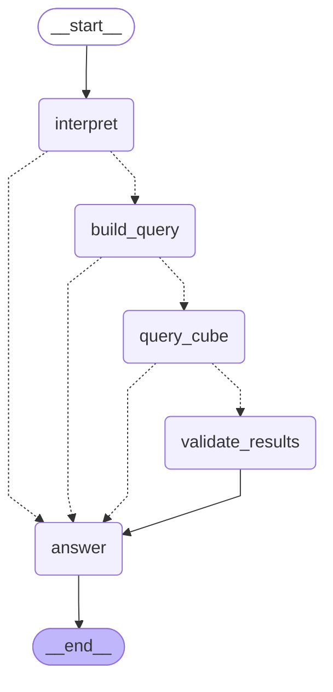

```mermaid
---
config:
  flowchart:
    curve: linear
---
graph TD;
	__start__([<p>__start__</p>]):::first
	interpret(interpret)
	build_query(build_query)
	query_cube(query_cube)
	validate_results(validate_results)
	answer(answer)
	__end__([<p>__end__</p>]):::last
	__start__ --> interpret;
	build_query -.-> answer;
	build_query -.-> query_cube;
	interpret -.-> answer;
	interpret -.-> build_query;
	query_cube -.-> answer;
	query_cube -.-> validate_results;
	validate_results --> answer;
	answer --> __end__;
	classDef default fill:#f2f0ff,line-height:1.2
	classDef first fill-opacity:0
	classDef last fill:#bfb6fc

```
